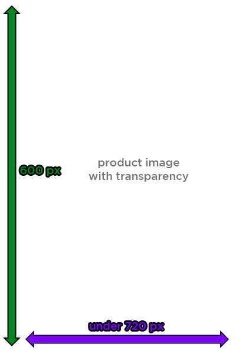

# [g-csg.github.io](g-csg.github.io)

The following project is an attempt to create a buying guide or infographic for buying products from China.

[Project Page](https://github.com/g-csg/g-csg.github.io)

[Website Page](https://g-csg.github.io/)

## Notes for Contributors

For any and every section, please use the following format:
(Preview this document [here!](https://g-csg.github.io/sample.html))

```Markdown
# Product Type Title

# Table of Contents
1. [Information About Section](#information-about-section)
1. [Product Type A](#product-type-a)
2. [Product Type B](#product-type-b)
3. [Additional Resources](#additional-resources)

# Information About Section
General information goes here if applicable

# Product Type A
1. [Product 1a](#product-1a) ($10)
2. [Product 2a](#product-2a) ($20)
3. [Product 3a](#product-3a) ($30)

## Product 1A
<p style="text-align:center;"></p>

Description Text

**Pros:**
- Pro 1
- Pro 2

**Cons:**
- Con 1
- Con 2

**Reviews:**
- [Review 1](https://www.youtube.com)
- [Review 2](https://www.google.com)

# Product Type B
1. [Product 1b](#product-1b) ($10)
2. [Product 2b](#product-2b) ($20)
3. [Product 3b](#product-3b) ($30)

## Product 1B
<p style="text-align:center;"></p>

Description Text

**Pros:**
- Pro 1
- Pro 2

**Cons:**
- Con 1
- Con 2

# Additional Resources
- [Google](https://www.google.com)
- [Other Website](https://www.google.com)
```

It may be applicable to use a table for listing product specifications (like for phones):
```Markdown

| Specification 	| Value |
|-------------------|------:|
| Price 			| $170 |
| Release Date		| January 2019 |
| Aspect Ratio		| 19.5:9 |
| Screen Size		| 6.3" |
| Chipset			| Snapdragon 660 |
| ROM/RAM Sizes 	| 3/32, 4/64, 4/128 |
| Battery Capacity 	| 4000 mAh |
| 3.5mm Jack? 		| Yes |
| SD Card Slot? 	| Yes |
```