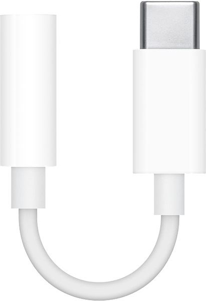
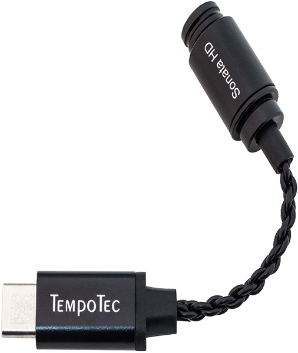
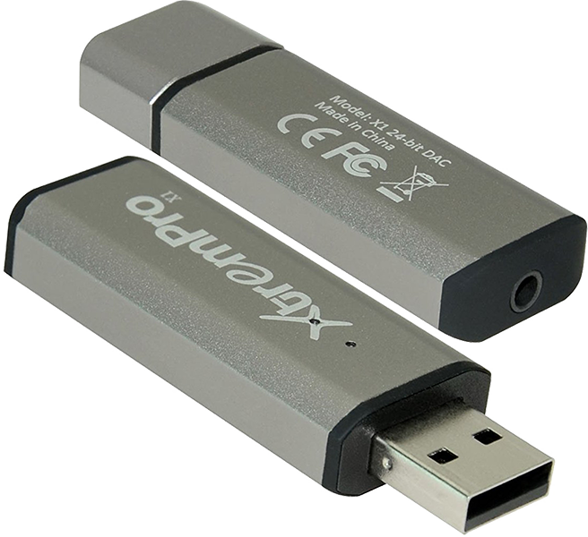

# Digital Audio Players, DACs and Amplifiers

# Table of Contents
1. [Digital-to-Audio Convertors (DACs)](#digital-to-audio-convertors-(dacs))
2. [Digital Audio Players (DAPs)](#digital-audio-players)
3. [Amplifiers](#amplifiers)

# Digital-to-Audio Convertors (DACs)
1. [Apple USB-C Dongle](#apple-usb-c-dongle) ($9)
2. [Tempotec Sonata HD](#tempotec-sonata-hd) ($30)
3. [XtremPro X1](#xtrempro-x1) ($30)
4. [FX-AUDIO DAC X6](#fx-audio-dac-x6) ($65)
5. [Topping D10](#topping-d10) ($70)
6. [Monoprice 111567](#monoprice-111567) ($80)
7. [Topping D30](#topping-d30) ($90)

## Apple USB-C Dongle

**Pros:**
- Supports in-line microphone and in-line controls, like those commonly found on earphones.

**Cons:**
- [Poor support for some Android devices](https://forum.xda-developers.com/mi-a1/how-to/t3917495)

**Reviews:**
- [AudioScienceReview](https://www.audiosciencereview.com/forum/index.php?threads/.5541/)

## Tempotec Sonata HD

**Also known as the "Hidizs Sonata HD**

**Pros:**
- Supports in-line microphone and in-line controls, like those commonly found on earphones.

**Cons:**
- Too few volume steps

**Reviews:**
- [Degru on Reddit](https://www.reddit.com/r/headphones/comments/bwweul/did_someone_say_dongles_tempotechidizs_sonata_hd/eq0w2fr/)

## XtremPro X1

**Also known as the Speaka USB DAC**

**Pros:**
- TODO

**Cons:**
- TODO

**Reviews:**
- [AudioScienceReview](https://www.audiosciencereview.com/forum/index.php?threads/.2423/)