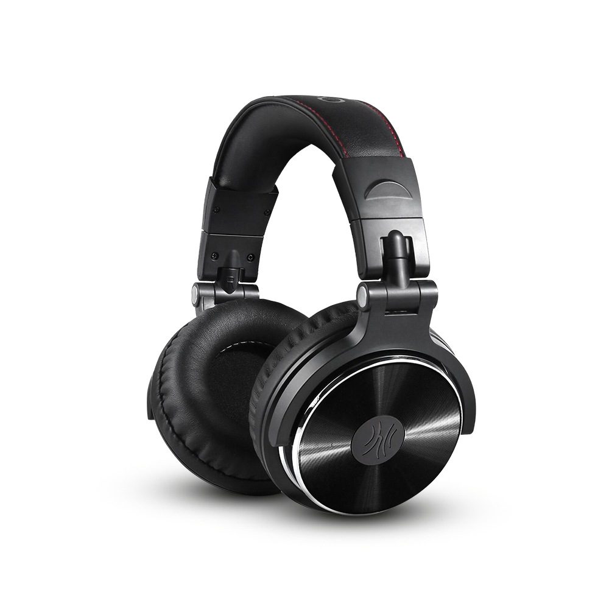

# Headphones

# Table of Contents
1. [On-Ear Headphones](#on-ear-headphones)
2. [Over-Ear Headphones](#over-ear-headphones)
3. [Additional Resources](#additional-resources)

# On Ear Headphones
TODO: Expand (add 1 more koss model)
1. [Koss KSC75](#koss-ksc75)
2. [Koss Porta Pro](#koss-porta-pro)

# Over-Ear Headphones
TODO: Expand
1. [OneOdio Studio Pro-10](#oneodio-studio-pro-10)

## OneOdio Studio Pro-10

Decent sounding headphones for the price. Supports both 3.5mm and 1/4-inch jacks and typically comes with good cables for both. Hinges and build quality are adequate. Pads are abover-average in comfort. Isolation is nothing special.

# Additional Resources:
TODO: Expand
 - [/r/Headphones](old.reddit.com/r/headphones) - Headphone (and earphone) community on Reddit
 - [/hpg/](4chan.org/g/hpg) - Headphone community on 4chan