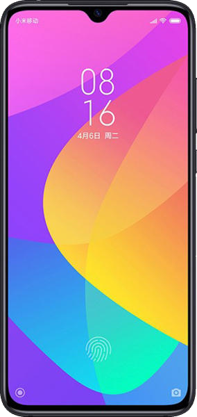

# Phones

# Table of Contents, Information
1. [Before You Buy](#before-you-buy)
2. [About Mediatek](#about-mediatek)
3. [About LeEco](#about-leeco)
4. [About Xiaomi](#about-xiaomi)
5. [About Global vs Chinese](#about-global-vs-chinese)
6. [Additional Resources](#additional-resources)
7. [Notes for Contributors](#notes-for-contributors)

# Table of Contents, Products
1. [Xiaomi Mi A2](#xiaomi-mi-a2) ($150)
2. [Xiaomi Mi A3](#xiaomi-mi-a3) (?)
3. [Xiaomi Redmi Note 7](#xiaomi-redmi-note-7) ($180)
4. [Xiaomi Pocophone F1](#xiaomi-pocophone-f1) ($280)
5. [Xiaomi Mi 9](#xiaomi-mi-9) ($400-$500)
6. [Xiaomi Mi 9 SE](#xiaomi-mi-9-se) ($300-400)
8. [Xiaomi Redmi K20 Pro](#xiaomi-redmi-k20-pro) ($400)
9. [Xiaomi Mi Mix 3](#xiaomi-mi-mix-3) ($500+)
10. [OnePlus 7](#oneplus-7) ($500-$700)

# Before You Buy
There are two main questions that must be considered with buying a phone from China:
 1. Is it compatible with my carrier?
 2. What shipping method should I choose?

Not all phones are compatible with all phone carriers (e.g. AT&T, T-Mobile, etc). This is especially problematic for Americans buying Chinese phones, because often these phones are more targeted for European markets. The actual reason(s) for this may be because America has strange cellular bands or because Chinese companies do not have enough market presence in America to care. Either way, **you must check for band compatibility for the phone you want before you buy it** or you'll run into problems with 3G/4G not working.

Use services like [willmyphonework.net](https://willmyphonework.net/) and [frequencycheck.com](https://www.frequencycheck.com/) to check for band compatibility on phones.

As for shipping, spending $10-$20 extra for insured shipping with tracking such as DHL or EMS is recommended, especially when expensive $100-$600 phones are being shipped overseas.

If you live in the USA, you don't have to worry about being taxed for importing products overseas unless you're [importing over $800 of goods](https://www.export.gov/article?id=Duties-and-Taxes-eCommerce-Guide-2) For other places in the world, that number (referred to as *De Minimis Value*) is far lower, typically around [0-200 USD.](https://global-express.org/assets/files/Customs%20Committee/de-minimis/GEA%20overview%20on%20de%20minimis_28%20March%202018.pdf) It may be beneficial to message a seller to declare that the phone is a "$20 mp3 player" on the package in order to avoid paying taxes.

On an unrelated note: If you live in the USA you *may* have issues with [importing products with a price above $130](https://www.reddit.com/r/RepLadies/comments/bjoj4h/help_superbuy_parcel_value_declarations_to_us/), while legally you can go up to $800 without issue, take this in consideration.

# About Mediatek
Mediatek is a Chinese semiconductor company that creates many SoCs (System on a Chip) for phones. They are often found on many budget (sub-$200) and ultra-budget (sub-$100) phones. Whilst their performance is typically slightly inferior to its Qualcomm Snapdragon (American semiconductor company) counterparts, It is common advice on /csg/ to **avoid Mediatek devices**, mainly due to two reasons:
1. Power consumption is signifcantly worse compared to Snapdragon; Snapdragon phones have better battery life in comparison
2. [Mediatek does not release kernel source code for their chipsets](https://www.xda-developers.com/mediatek-source-code-release-no-plans/); Rarely will you see custom roms or root(ing) support for Mediatek phones because of this.

Custom roms and rooting are outside the scope of this guide, but they greatly extend the life of your device. Custom roms can get updates when official updates stop, allow for a large amount of system-level customization. If it were not for this, Mediatek would be far more popular than it currently is within the budget phone community.

# About LeEco
LeEco used to make budget and mid-range smartphones but as of mid-2017 they have left the smartphone market. This is most likely because in May 2017 the company began to succumb to financial issues and in July 2017, [LeEco's president fled China after Chinese legal courts froze his assets](https://tinyurl.com/yxvgvazf) Their phones can be had for fairly cheap now but know that their latest phone(s) are from 2017.

# About Xiaomi
Xiaomi is well known for their budget smartphones and are gaining more popularity as of recently for their "flagship killers." They are often compared to Apple and sometimes touted as the "Apple of China." They make more than just smartphones; including shoes, smart watches, smart vacuums, facemasks, backpacks, power banks, and hand tools. Most Xiaomi products are of high quality, with a few notable exceptions such as their very low-end phones and the Mediatek varients of some of their phones. I speculate that their popularity in the United States will increase further as they include better band support for their phones for USA carriers.

## About Global vs Chinese
Xiaomi notably has a distinction of rolling out it's phones to Chinese and sometimes Indian markets first, and to Rest of World second (Europe, America, etc). A significant distinction will be:
1. The LTE bands used in a Chinese phone to a Global one.
2. A Chinese version of MIUI (Xiaomi's ROM) flashed over a Global one.

Chinese devices will definitely lack Band 20 which is used in a lot of Western European countries, Global devices will lack Chinese bands.
You will most likely want to buy the Global version over the Chinese version unless you live in China. As said before, check Kimovil's frequency checker to your country between versions and make the
best decision.

The Chinese MIUI will most likely have some bloatware or popular Chinese apps that can usually be easily removed. Take note that you can also flash Global MIUI over a Chinese device,
(which is something resellers will do on Chinese phones), but be aware when buying and check if you still have Band 20.

Global version phones are usually rolled out a few months after the release in the Chinese market.

# Additional Resources
- [kimovil.com](https://www.kimovil.com/en/), a very useful phone comparison website with live price-checks and coupons
- [CouponsFromChina Smartphones](https://couponsfromchina.com/2019/01/26/smartphones-deals-coupons-list-gearbest/) - A website listing Gearbest and Banggood coupons.

---

**It is currently not possible to center the tables below, see [this stackoverflow post](https://stackoverflow.com/q/44172954)**

## [Xiaomi Mi A2](https://www.kimovil.com/en/where-to-buy-xiaomi-mi-a2)

| Specification 	| Value |
|-------------------|------:|
| Price 			| $150 |
| Release Date		| July 2018 |
| Aspect Ratio		| 18:9 |
| Screen Size		| 6" |
| Chipset			| Snapdragon 660 |
| ROM/RAM Sizes 	| 4/32, 4/64, 6/128 |
| Battery Capacity 	| 3000 mAh |
| 3.5mm Jack? 		| No |
| SD Card Slot? 	| No |

**Pros:**
- Stock Android with no Chinese software bloat.
- Good chipset, especially at this price
- IR Blaster
- Decent camera

**Cons:**
- Lacks a 3.5mm jack
- Lacks MicroSD slot
- Ugly "iPhone X"-esque rear camera hump, but worse. Can probably be saved using a case.
- Soon to be obsolete by the Mi A3.

**Reviews:**
- [TechTablets Review](https://www.youtube.com/watch?v=rxerUpwgOq0)

## [Xiaomi Mi A3](https://www.kimovil.com/en/where-to-buy-xiaomi-mi-a3)

(Note, this phone is currently yet to be announced, info subject to change!!)

| Specification 	| Value |
|-------------------|------:|
| Price 			| ? |
| Announcement Date		| July 17th 2019 |
| Aspect Ratio		| 19.5:9 |
| Screen Size		| 6.09" |
| Chipset			| Snapdragon 675 |
| ROM/RAM Sizes 	| 4/64, 4/128 (?) |
| Battery Capacity 	| 4030 mAh |
| 3.5mm Jack? 		| Yes |
| SD Card Slot? 	| Yes |

## [Xiaomi Redmi Note 7](https://www.kimovil.com/en/where-to-buy-xiaomi-redmi-note-7-global)

| Specification 	| Value |
|-------------------|------:|
| Price 			| $170 |
| Release Date		| January 2019 |
| Aspect Ratio		| 19.5:9 |
| Screen Size		| 6.3" |
| Chipset			| Snapdragon 660 |
| ROM/RAM Sizes 	| 3/32, 4/64, 4/128 |
| Battery Capacity 	| 4000 mAh |
| 3.5mm Jack? 		| Yes |
| SD Card Slot? 	| Yes |

**Make sure to buy the global varient of this phone!**

**Pros:**
- Good chipset, especially at this price
- Long battery life
- FM Radio
- IR Blaster

**Cons:**
- Chinese bloatware (can be solved with root)
- Poor camera (not true 48 MP, downsamples to 12 MP)

**Reviews:**
- [TechTablets](https://www.youtube.com/watch?v=WlHviu7YaNY)

## [Xiaomi Pocophone F1](https://www.kimovil.com/en/where-to-buy-xiaomi-pocophone-f1)

| Specification 	| Value |
|-------------------|------:|
| Price 			| $280 |
| Release Date		| August 2018 |
| Aspect Ratio		| 18:9 |
| Screen Size		| 6.18" |
| Chipset			| Snapdragon 845 |
| ROM/RAM Sizes 	| 6/64, 6/128 |
| Battery Capacity 	| 4000 mAh |
| 3.5mm Jack? 		| Yes |
| SD Card Slot? 	| Yes |

**Pros:**
- todo

**Cons:**
- todo

## [Xiaomi Mi 9](https://www.kimovil.com/en/where-to-buy-xiaomi-mi-9-global)

| Specification 	| Value |
|-------------------|------:|
| Price 			| $400 |
| Release Date		| February 2019 |
| Aspect Ratio		| 19.5:9 |
| Screen Size		| 6.4" |
| Chipset			| Snapdragon 855 |
| ROM/RAM Sizes 	| 6/64, 6/128 |
| Battery Capacity 	| 3300 mAh |
| 3.5mm Jack? 		| No |
| SD Card Slot? 	| No |

**Pros:**
- todo

**Cons:**
- Made somewhat obsolete by the K20/K20 Pro.

## [Xiaomi Mi 9 SE](https://www.kimovil.com/en/where-to-buy-xiaomi-mi-9-global)

| Specification 	| Value |
|-------------------|------:|
| Price 			| $300 |
| Release Date		| February 2019 |
| Aspect Ratio		| 19.5:9 |
| Screen Size		| 5.97" |
| Chipset			| Snapdragon 712 |
| ROM/RAM Sizes 	| 6/64, 6/128 |
| Battery Capacity 	| 3010 mAh |
| 3.5mm Jack? 		| No |
| SD Card Slot? 	| No |

**Pros:**
- Slightly shorter, improved ergonomics for those with smaller hands.
- Near identical appearance to the Mi 9, chin is more pronounced on the SE.

**Cons:**
- Made somewhat obsolete by the Mi 9T, which is K20 based (has popout cam).
- Lacks laser Autofocus of the Mi 9.
- Lacks wireless charging of the Mi 9.
- Lacks notification LED.

## [Xiaomi Redmi K20 Pro](https://www.kimovil.com/en/where-to-buy-redmi-855)

| Specification 	| Value |
|-------------------|------:|
| Price 			| $360 |
| Release Date		| May 2019 |
| Aspect Ratio		| 19.5:9 |
| Screen Size		| 6.4" |
| Chipset			| Snapdragon 855 |
| ROM/RAM Sizes 	| 6/64, 6/128, 8/128, 8/256 |
| Battery Capacity 	| 4000 mAh |
| 3.5mm Jack? 		| Yes |
| SD Card Slot? 	| No |

**Avoid this phone for now** until more reviews are released.

Most likely will be released as the Mi 9T Pro in Global territories.

**Pros:**
- Samsung AMOLED screen
- Above average camera
- Flagship chipset
- Good battery life

**Cons:**
- MIUI can be bloated
- Auto-brightness is meh
- Missing some LTE bands
- Not available globally (for the moment)
- Poor low-light camera quality when not using HDR+

**Reviews:**
- [Marques Brownlee](https://www.youtube.com/watch?v=WpPw7lUXyI0)
- [GSMArena](https://www.gsmarena.com/xiaomi_mi_9t-review-1950.php)

## [Xiaomi Mi Mix 3](https://www.kimovil.com/en/where-to-buy-xiaomi-mi-mix-3-global)

| Specification 	| Value |
|-------------------|------:|
| Price 			| $450 |
| Release Date		| October 2018 |
| Aspect Ratio		| 19.5:9 |
| Screen Size		| 6.4" |
| Chipset			| Snapdragon 845 |
| ROM/RAM Sizes 	| 6/128 |
| Battery Capacity 	| 3200 mAh |
| 3.5mm Jack? 		| No |
| SD Card Slot? 	| No |

Part of Xiaomi's premium smartphone line(s). A slight side-grade to the Mi 9, and features a sliding selfie camera.

**Pros:**
- todo

**Cons:**
- todo

## [OnePlus 7](https://www.kimovil.com/en/where-to-buy-oneplus-7)

| Specification 	| Value |
|-------------------|------:|
| Price 			| $600+ |
| Release Date		| May 2019 |
| Aspect Ratio		| 19.5:9 |
| Screen Size		| 6.4" |
| Chipset			| Snapdragon 855 |
| ROM/RAM Sizes 	| 6/128, 8/256 |
| Battery Capacity 	| 3700 mAh |
| 3.5mm Jack? 		| No |
| SD Card Slot? 	| No |

**Pros:**
- todo

**Cons:**
- todo

## Notes for Contributors

- Images are 600 pixels wide, using the "front and back" phone image
- Add *good* reviews
